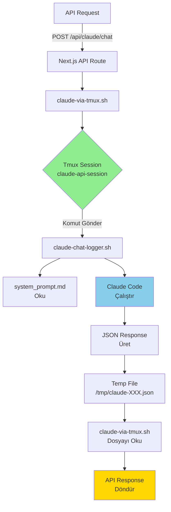

# 📂 Scripts Klasörü - Claude API Integration Dokümantasyonu

## 🗂️ Dosya Yapısı (Temizlenmiş)

```
/home/ali/balkanlarinzirveleri/scripts/
│
├── claude-chat-logger.sh       # ✅ Ana Claude wrapper script
├── claude-via-tmux.sh          # ✅ API için tmux üzerinden çalıştırıcı
├── init-claude-session.sh      # Tmux session başlatıcı
├── mock-claude.sh              # Test için mock response generator
├── test-claude-api.sh          # API endpoint test script'i
├── system_prompt.md            # Claude için sistem prompt'u
├── README.md                   # Bu dokümantasyon
│
├── instagram-automation.sh     # Instagram otomasyon script'i
└── run-instagram-automation.sh # Instagram runner
```

## 🔄 Çalışma Akışı Diagramı



## 📝 Basit Açıklama

### 1️⃣ **API İsteği Gelir**
```javascript
// Client tarafından
fetch('/api/claude/chat', {
  method: 'POST',
  headers: { 'Content-Type': 'application/json' },
  body: JSON.stringify({ prompt: "Soru" })
})
```

### 2️⃣ **Next.js Route Handler**
```typescript
// app/api/claude/chat/route.ts
const { stdout } = await execAsync(`./claude-via-tmux.sh "${prompt}"`, {
  cwd: scriptsDir,
  shell: '/bin/bash'
})
```

### 3️⃣ **claude-via-tmux.sh Çalışır**
```bash
#!/bin/bash
# Tmux session'da komut çalıştır
tmux send-keys -t claude-api-session \
  "cd /home/ali/balkanlarinzirveleri/scripts && \
   ./claude-chat-logger.sh '$PROMPT' > /tmp/claude-XXX.json"
```

### 4️⃣ **Tmux Session İçinde**
```
claude-api-session (Terminal Session)
├── Login olmuş kullanıcı: ali
├── Claude authenticated ✓
└── claude-chat-logger.sh çalışır
```

### 5️⃣ **claude-chat-logger.sh İşlemi**
```bash
# 1. System prompt'u oku
SYSTEM_PROMPT=$(cat system_prompt.md)

# 2. Prompt'ları birleştir
COMBINED_PROMPT="$SYSTEM_PROMPT
User request: $PROMPT"

# 3. Claude'a gönder
claude --dangerously-skip-permissions -p "$COMBINED_PROMPT"

# 4. JSON çıktısını yakala ve göster
{
  "response": "Claude'un cevabı"
}
```

### 6️⃣ **Response Dönüşü**
```
Temp File → claude-via-tmux.sh → API Route → Client
```

## 🔑 Neden Çalışıyor?

| Özellik | Açıklama |
|---------|----------|
| **Tmux Session** | Terminal session'ını korur, authentication context'i kaybolmaz |
| **Authentication** | Login olan kullanıcının session'ını kullanır |
| **Temp File** | Process'ler arası güvenli iletişim |
| **Timeout** | 30 saniye bekler, timeout durumunda error döner |

## ⚡ Kurulum ve Kullanım

### İlk Kurulum (Bir Kere)
```bash
# 1. Scripts'leri executable yap
chmod +x *.sh

# 2. Tmux session başlat
./init-claude-session.sh

# 3. Tmux session'a bağlan ve Claude login ol
tmux attach -t claude-api-session
claude login
# (Login olduktan sonra Ctrl+B, D ile çık)
```

### API Başlatma
```bash
# Next.js development server'ı başlat
cd /home/ali/balkanlarinzirveleri
npm run dev
```

### API Test
```bash
# Test script ile
./test-claude-api.sh

# veya doğrudan curl ile
curl -X POST http://localhost:3000/api/claude/chat \
  -H "Content-Type: application/json" \
  -d '{"prompt": "Merhaba, nasılsın?"}'
```

## 🎯 Özet

**Problem:** API context'inde Claude authentication kayboluyor
**Çözüm:** Tmux session'da authenticated terminal kullan
**Sonuç:** Gerçek Claude yanıtları API'den dönüyor ✅

## 🚨 Önemli Notlar

1. **Tmux Session:** `claude-api-session` adlı tmux session her zaman açık kalmalı
2. **Authentication:** Claude login session'ı tmux içinde korunur
3. **Temp Files:** `/tmp` dizininde geçici dosyalar oluşturulur ve silinir
4. **Timeout:** İstekler maksimum 30 saniyede timeout olur
5. **System Prompt:** `system_prompt.md` dosyası her istekte okunur

## 📊 Performans

- **Ortalama Response Süresi:** 2-5 saniye
- **Maksimum Timeout:** 30 saniye
- **Concurrent Request:** Desteklenmez (sıralı işlenir)

## 🐛 Sorun Giderme

### Session Bulunamadı Hatası
```bash
# Tmux session'ı yeniden başlat
./init-claude-session.sh
tmux attach -t claude-api-session
claude login
```

### Timeout Hatası
```bash
# Tmux session'da manuel test
tmux attach -t claude-api-session
./claude-chat-logger.sh "test"
```

### Authentication Hatası
```bash
# Tmux içinde yeniden login ol
tmux attach -t claude-api-session
claude login
```

## 📜 Çalışan Script Detayları

### ✅ claude-via-tmux.sh (API Ana Script)
**Amaç:** API isteklerini tmux session üzerinden Claude'a iletir
```bash
# Kullanım
./claude-via-tmux.sh "Soru veya komut"

# Özellikler
- Tmux session kontrolü
- Temp file üzerinden response
- 30 saniye timeout
- JSON output
```

### ✅ claude-chat-logger.sh (Claude Wrapper)
**Amaç:** System prompt ekleyerek Claude'u çalıştırır
```bash
# Kullanım
./claude-chat-logger.sh "Soru veya komut"

# Özellikler
- system_prompt.md dosyasını okur
- Claude'a prompt gönderir
- JSON formatında output
- Log dosyası oluşturur (/home/ali/claude-logs/)
```

### ✅ init-claude-session.sh (Session Başlatıcı)
**Amaç:** İlk kurulum için tmux session oluşturur
```bash
# Kullanım (bir kere çalıştırılır)
./init-claude-session.sh

# İşlemler
- claude-api-session adlı tmux session oluşturur
- Session'ı kontrol eder
```


### ✅ test-claude-api.sh (API Test)
**Amaç:** API endpoint'ini test eder
```bash
# Kullanım
./test-claude-api.sh

# Test eder
- http://localhost:3000/api/claude/chat
- JSON response kontrolü
```

---

*Son Güncelleme: 2025-09-19*
*Yazar: Claude Code Assistant*